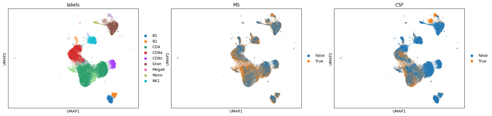
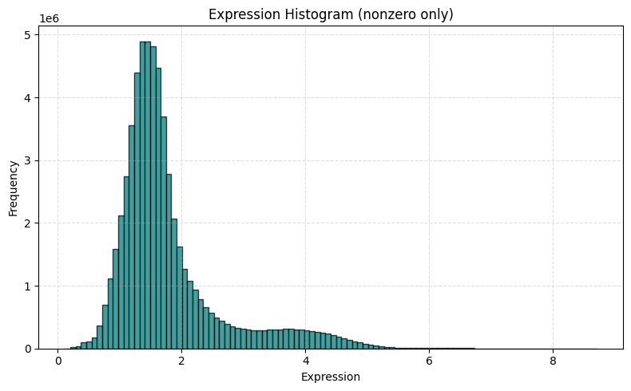
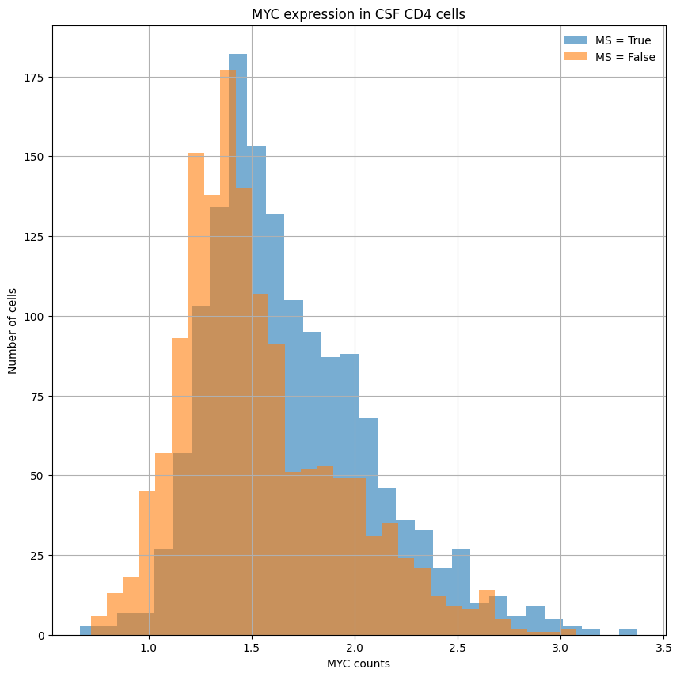

# Summary

    * Organelle-specific genes obtained from HPA for peroxisome (Pex) and mitochondria (Mt)
    * Significantly differentially expressed genes (DEGs) were filtered for these genes
    * STRING PPI network used to construct protein-paths between Pex and Mt DEGs
    * Paths were scored and ranked by number of DEGs in path

The relevant notebook is in `notebooks/scRNAseq.ipynb`.

# Report

Analysis is done using the author provided dataset. We did go down the path of loading the 10X data directly from GEO but upon finding the author-provided AnnData object we opted for that for several reasons:

- We were able to recreate the paper's UMAP immediately 

- Automated cell typing was performed on the GEO data using [CellTypist](https://www.celltypist.org/) using their `Immune_All_Low.pkl` model, but the cell types don't immediately match the paper and I wasn't comfortable mapping immune cell type names

- We can immediately use the supplemental data without fussing about mirroring the data processing procedure

**n.b.** There are a considerable amount of genes filtered out in their data, most notable being `PPRC1`, which is a gene at the intersection of peroxisomal and mitochondrial biology.

For differential expression analysis, we used Supplemental Dataset 4 and 5 (MS vs. Normal for each cell type, blood and CSF respectively).

To obtain a reasonable set of genes that are peroxisome-related, we used the Human Protein Atlas with custom columns to further curate based on immune-cell presence. We hypothesized that the interplay between the peroxisome and mitochondria would have interesting biology so we obtained mitochondria-related genes as well. The final numbers were:

    * Number of Peroxisome genes: 151 (only 113 present in dataset)
    * Number of Mitochondria genes: 1630 (only 1261 present in dataset)
    * Number of genes in both the Peroxisome and Mitochondria: 51 (only 39 present in dataset)

**n.b.** The GEO dataset had 141/151 Pex genes and 1504/1630 Mt genes, so these were initially present

Since we are using the author's dataset, I wanted to get a sense the data's distribution  which appeared in line with being log-transformed data.

For differential expression, the authors mention subjecting each gene to three tests to determine significance (U-test, edgeR, scVI) and only using genes that are concordantly significant across all three in analysis. It is unclear whether the data provided in the Supplemental actually followed this rule. An example of something that appears to violate this standard is `Myc` which had an FDR-corrected p-value of ~0 for the U-test but ~0.2 for edgeR. We plotted the relevant Myc expression to get a better sense of the situation 

We proceeded by filtering the differential expression table for rows where both `fdr_wil` and `fdr_edgeR` were <0.05. We were left with

| Direction | Tissue | Count |
|-----------|--------|-------|
| up        | blood  | 2506  |
| up        | csf    | 1407  |
| down      | csf    | 287   |
| down      | blood  | 268   |

Naively, we can simply see what organelle (Pex, Mt, and Pex ∪ Mt) genes are significantly upregulated when comparing MS to normal:

Number of upregulated Pex genes: 26
Number of upregulated Mt genes: 386
Number of Pex & Mt genes: 9

As a first approximation, the 26 Pex genes upregulated in MS would be reasonable targets for inhibition.

The interplay between peroxisomes and mitochondria may also provide valuable targets. The two organelles cooperate for lipid metabolism and to balance oxidative stress.

Using the STRING PPI network we can find the shortest paths between the significantly differentially expressed Pex genes and Mt genes. We can then score paths based on the number of members that are also significantly different.

We construct a graph G from the STRING PPI network filtered for a combined_score >= 900. We assign edge weights to the inverse of the combined score. We then find the shortest weighted path between significant Pex genes and significant Mt genes and score the path based on the number of members of the path that are significantly different regardless of direction. We penalize larger paths, preferring more direct relationships.

To loosely handle the different cell types and tissues, we are only storing paths that have DEGs that come from the same tissue/cell type. Scores are saved in `data/path_scores.xlsx`.

We consistently see the mitochondrial targets `TSFM`, `MRPS27`, `MRPS16`, and `MRPS5` in our pathway scores. The Pex source genes (and thus, the final ranked candidate genes) are:

1. CRAT
2. ECH1
3. HSD17B4
4. SCP2
5. MED1

# Summary

    * Organelle-specific genes obtained from HPA for peroxisome (Pex) and mitochondria (Mt)
    * Significantly differentially expressed genes (DEGs) were filtered for these genes
    * STRING PPI network used to construct protein-paths between Pex and Mt DEGs
    * Paths were scored and ranked by number of DEGs in path

